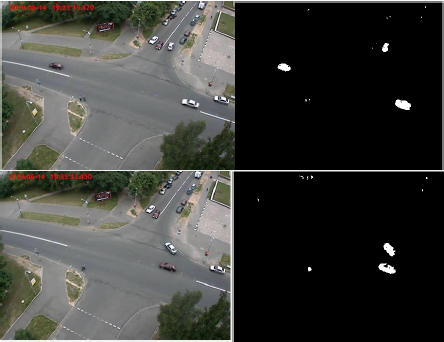
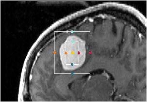
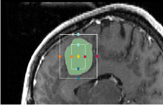

# Machine Learning and Computer Vision programming
Here is the collection of previous work and exercises I've done in ML and CV fields during my study. Codes are written in Matlab and Python mainly. 

## Machine Learning
* [Perceptron](https://github.com/kitsunekun0v0/little-work/blob/master/ml/averaged_perceptron_classifier.py) - **Perceptron** can be seen as a single layer neuron network. This is a averaged weight perceptron for multi-classes classification written in **Python**. 
* [KNN](https://github.com/kitsunekun0v0/little-work/blob/master/ml/kNearestNeighbour.py) - A fully vectorised **KNN classifier** using L2 distance, written in **Python**. 
* [Naive Bayes for Gaussian distributed data](ml/gaussianNB.py) - Simple **Naive Bayes classifier** for Gaussian distributed input data. Implemented in **Python**.
* [Softmax Cross-entropy](https://github.com/kitsunekun0v0/little-work/blob/master/ml/softmax.py) - **Python** function for finding loss and gradient of weight.
* [Softmax + SGD](https://github.com/kitsunekun0v0/little-work/blob/master/ml/sgd_softmax.py) - Implementation of **SGD**. It can be a **python function** for training **multinominal logistic regression**. 

**Neuron Network**
* [Fully Connected Network (use Numpy)](ml/fc_NN) - A **fully connected neuron network** that allows arbitrary number of hidden layers, with softmax loss function and ReLU activate function. Written in **Python**, only use **Numpy**. 
* [Competitive Learning](https://github.com/kitsunekun0v0/little-work/blob/master/ml/simple_competitive_learning.m) - **Competitive Learning** is an unsupervised technique to **cluster data**. This is a **Matlab** implementation of a simple Competitive Learning. 

**Reinforcement Learning**
* [SARSA](ml/sarsa) - **SARSA algorithm** implemented in **Matlab**. Q table is replaced by simple one layer neuron network. 
* [SARSA-Lambda](ml/sarsa_lambda) - **Sarsa-lambda** implemented in **Matlab**. Very similar to Sarsa except the additional egibility part in learning process. 

## Computer Vision
* [Object Tracking with RGB-D videos](https://github.com/kitsunekun0v0/little-work/blob/master/gradProj) - Extended **PSO tracker** which is able to handle object occlusion, rescale and deformation. [Demo](https://drive.google.com/open?id=1VUYG8pg84g_cW8Nsm24fI5o-Ac1enzce)
* [ViBe](https://github.com/kitsunekun0v0/little-work/blob/master/vibe.m) - ViBe is an **background subtrauction algorithm** for videos. Refer to the [original paper](https://orbi.uliege.be/bitstream/2268/145853/1/Barnich2011ViBe.pdf) for more algorithm details. Codes written in **Matlab**.

**3D Slicer**
* A [3D Slicer module (.py)](https://github.com/kitsunekun0v0/little-work/blob/master/cv/ROISegmentation1.py) for segmentation with ROI annotation tool. The ROI annotation tool is used to define the boundary of ROI, and points in ROI are used as seeding points for segmentation.

 
